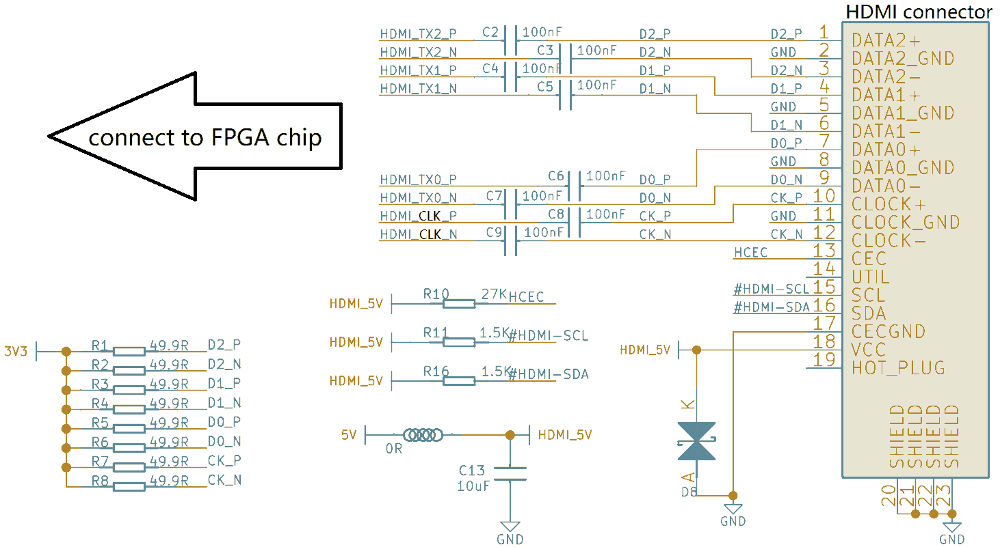
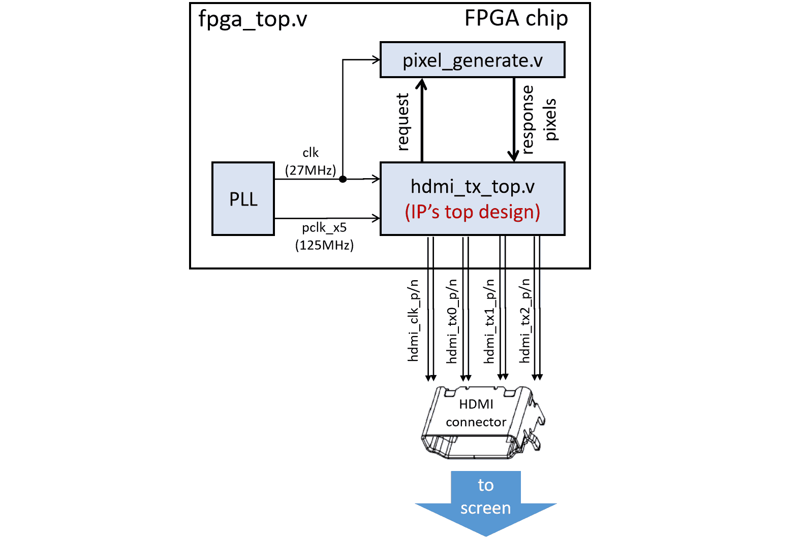

-9A90FD.svg)   

　

<span id="en">FPGA HDMI display controller</span>
===========================

This repo offers an **FPGA**-based **HDMI** **display** **controller** to display videos via HDMI, features:

* Pure Verilog implementation, compatible with various FPGA platforms.
* Use a simple user interface to fetch pixels from user's logic.
* Internally implemented clock domain cross. Therefore, the clock frequency of the user interface can be independent of the HDMI clock.

|  |
| :------------------------------: |
|   Figure: diagram of this IP.    |

　

　

　

# Hardware Setup

### Connection

You should connect 4 TMDS differential pairs (8 pins) from HDMI connector to FPGA chip:

- hdmi_clk_p, hdmi_clk_n
- hdmi_tx0_p, hdmi_tx0_n
- hdmi_tx1_p, hdmi_tx1_n
- hdmi_tx2_p, hdmi_tx2_n

### Signal voltage level

Although these signals are 4 differential pairs, they are actually regarded as 8 single-ended IO pins in FPGA.

All 8 IO pins should be **2.5V** **voltage** **level** , and the corresponding **IO** **bank** **power** **should** **be** **2.5V** .

### FPGA IO constraints

Correspondingly, in the FPGA development software, you should constrain all these 8 IO pins as LVCMOS-2.5V (or LVTTL-2.5V), neither pull-up nor pull-down.

Besides, don't forget to constrain the FPGA IO positions of these 8 pins (refer to the schematic of the FPGA  board).

The format of IO constraint files varies among different FPGA manufacturers. Taking [GOWIN FPGA](https://www.gowinsemi.com.cn/) as an example, the CST constraint file may be written as follows:

```
IO_LOC  "hdmi_tx0_n" 29;    IO_PORT "hdmi_tx0_n" IO_TYPE=LVCMOS25 PULL_MODE=NONE DRIVE=8;
IO_LOC  "hdmi_tx0_p" 30;    IO_PORT "hdmi_tx0_p" IO_TYPE=LVCMOS25 PULL_MODE=NONE DRIVE=8;

IO_LOC  "hdmi_tx1_n" 31;    IO_PORT "hdmi_tx1_n" IO_TYPE=LVCMOS25 PULL_MODE=NONE DRIVE=8;
IO_LOC  "hdmi_tx1_p" 32;    IO_PORT "hdmi_tx1_p" IO_TYPE=LVCMOS25 PULL_MODE=NONE DRIVE=8;

IO_LOC  "hdmi_tx2_n" 34;    IO_PORT "hdmi_tx2_n" IO_TYPE=LVCMOS25 PULL_MODE=NONE DRIVE=8;
IO_LOC  "hdmi_tx2_p" 35;    IO_PORT "hdmi_tx2_p" IO_TYPE=LVCMOS25 PULL_MODE=NONE DRIVE=8;

IO_LOC  "hdmi_clk_n" 27;    IO_PORT "hdmi_clk_n" IO_TYPE=LVCMOS25 PULL_MODE=NONE DRIVE=8;
IO_LOC  "hdmi_clk_p" 28;    IO_PORT "hdmi_clk_p" IO_TYPE=LVCMOS25 PULL_MODE=NONE DRIVE=8;
```


### Reference circuit schematic

For specific circuit schematic design, referred to [the schematic of Tang-Nano-4K FPGA board](https://wiki.sipeed.com/hardware/zh/tang/Tang-Nano-4K/Nano-4K.html#%E8%B5%84%E6%96%99)

|  |
| :-------------------------------------------: |
|      Figure: Reference hardware design.       |

　

　
　

# Module Description

 [hdmi_tx_top.v](./RTL/hdmi_tx_top.v) is the top design of this IP. The input and output signals are:

```verilog
module hdmi_tx_top #(
    // the parameter of request to response latency ---------------------------------------
    parameter         RESP_LATENCY = 1,        // 1, 2, or 3
    // paramter of video sizes ------------------------------------------------------------
    parameter  [13:0] H_TOTAL      = 14'd800,
    parameter  [13:0] H_DRAW_START = 14'd0,
    parameter  [13:0] H_DRAW_WIDTH = 14'd640,
    parameter  [13:0] H_SYNC_START = 14'd656,
    parameter  [13:0] H_SYNC_WIDTH = 14'd96,
    parameter  [13:0] V_TOTAL      = 14'd525,
    parameter  [13:0] V_DRAW_START = 14'd0,
    parameter  [13:0] V_DRAW_HEIGHT= 14'd480,
    parameter  [13:0] V_SYNC_START = 14'd490,
    parameter  [13:0] V_SYNC_HEIGHT= 14'd2
) (
    // user's clock and reset -------------------------------------------------------------
    input  wire       rstn,
    input  wire       clk,        // can be asynchronous with pclk_x5. Its frequency must be slightly higher than f(pclk_x5) / 5
    // user's pixel request interface (these signals synchronize with clk) ----------------
    output reg        req_en,     // request for a pixel
    output reg        req_sof,    // the requested pixel is at start of frame
    output reg        req_eof,    // the requested pixel is at end   of frame
    output reg        req_sol,    // the requested pixel is at start of line
    output reg        req_eol,    // the requested pixel is at end   of line
    // user's pixel response interface (these signals synchronize with clk) ---------------
    input  wire [7:0] resp_red,
    input  wire [7:0] resp_green,
    input  wire [7:0] resp_blue,
    // HDMI driving clock, whose frequency must be 5 * pclk (pclk is the pixel clock) -----
    input  wire       pclk_x5,
    // HDMI TX out ------------------------------------------------------------------------
    output wire       hdmi_clk_p,
    output wire       hdmi_clk_n,
    output wire       hdmi_tx0_p,
    output wire       hdmi_tx0_n,
    output wire       hdmi_tx1_p,
    output wire       hdmi_tx1_n,
    output wire       hdmi_tx2_p,
    output wire       hdmi_tx2_n
);
```

　

### Configure video resolution and frequency

The default parameter settings will generate a video of 640x480 @ 59.5Hz, which corresponds to a pixel frequency of 25MHz.

This configuration is referenced from another [FPGA HDMI project by FPGA4FUN](https://www.fpga4fun.com/HDMI.html) .

If you want other video resolution and frame rate, please refer to relevant specifications.

　

### Clocks

You should provide the following two clocks of this module :

|      Clock name      |             `pclk_x5`             |        `clk`         |
| :------------------: | :-------------------------------: | :------------------: |
|   **description**    |        HDMI driving clock         |     user's clock     |
|    **frequency**     | Five times of the pixel frequency |                      |
|  **minimum freq.**   |              125MHz               |    f(pclk_x5) / 5    |
|  **typical freq.**   |    125MHz  (640x480 @ 59.5Hz)     |    25MHz - 200MHz    |
| **How to determine** | based on video resolution and FPS | based on user needs. |

　

### Pixel request&response interface

When the module is running, it will request for video pixels from outside (i.e. from user), so you should response these pixels according to the module's interface timing. The request and response signals are:

|   Signal Name    | Direction | Bit Width |                         Description                         |
| :--------------: | :-------: | :-------: | :---------------------------------------------------------: |
|   **`req_en`**   |  output   |     1     |                     Request for a pixel                     |
|  **`req_sof`**   |  output   |     1     | The requested pixels is the first pixel of the entire frame |
|  **`req_eof`**   |  output   |     1     | The requested pixels is the last pixel of the entire frame  |
|  **`req_sol`**   |  output   |     1     |      The requested pixels is the first pixel of a line      |
|  **`req_eol`**   |  output   |     1     |      The requested pixels is the last pixel of a line       |
|  **`resp_red`**  |   input   |     8     |              Red channel of the response pixel              |
| **`resp_green`** |   input   |     8     |             Green channel of the response pixel             |
| **`resp_blue`**  |   input   |     8     |             Blue channel of the response pixel              |

Note that **all request and response pixel signals should be operated in the clock domain of** **`clk`** .

The module requests pixels in raster order, that is, frame by frame, row, by row, from left to right.

Whenever `req_en` =1, it indicates that the module is requesting a pixel, and you need to make this pixel appear on the response signals (**`resp_red, resp_green, resp_blue`**) in the *N*th cycle thereafter. Where *N* is the response latency, which can be configured as 1, 2, or 3, achieved by configuring the  `RESP_LATENCY` parameter.

The module also provide several auxiliary request signals:

- When the requested pixel is the first pixel of a entire frame, `req_sof`=1
- When the requested pixel is the last pixel of a entire frame, `req_eof`=1
- When the requested pixel is the first pixel of a row, `req_sol`=1
- When the requested pixel is the first pixel of a row, `req_eol`=1

　

　

　

# FPGA Example

Here we provide a simple FPGA example that can display scrolling green to purple stripes on the screen.

The top Verilog file of this example is [fpga_top.v](./fpga_example/RTL/fpga_top.v) 

This example can directly run on [GOWIN Tang-Nano-4K FPGA board](https://wiki.sipeed.com/hardware/zh/tang/Tang-Nano-4K/Nano-4K.html). Just open the project file ([fpga_example/hdmi.gprj](./fpga_example/hdmi.gprj)) use the [GOWIN FPGA Designer Software](https://www.gowinsemi.com.cn/faq.aspx#1), compile the project and program the FPGA.

If you want to run this example on FPGA from other manufacturers, you only need to rewrite the constraint file, without modifying the Verilog code.

The following figure is the block diagram of this example.

|  |
| :--------------------------------------------: |
|   Figure: block diagram of the FPGA example.   |

　

　

　

# Simulation and Verification

The simulation design is in the [SIM](./SIM) folder.

The following figure is the block diagram of the simulation.

|  |
| :------------------------------------------: |
|   Figure: block diagram of the simulation.   |

　

　

　

# Reference

[1] FPGA HDMI project: https://www.fpga4fun.com/HDMI.html , FPGA4FUN.

[2] GOWIN Tang Nano 4K FPGA development board: https://wiki.sipeed.com/hardware/zh/tang/Tang-Nano-4K/Nano-4K.html , Sipeed.

[3] HDMI Specification Version 1.3a: https://ez.analog.com/cfs-file/__key/telligent-evolution-components-attachments/00-317-00-00-00-05-21-37/HDMISpecification13a.pdf

[4] HDMI Specification Version 1.4b: https://www.hdmi.org/spec/hdmi1_4b
