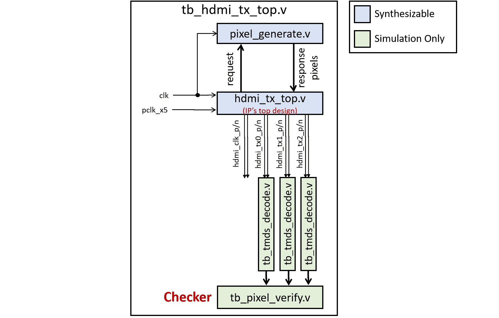

-9A90FD.svg)   

　

<span id="en">FPGA HDMI display controller</span>
===========================

This repo offers an **FPGA**-based HDMI display controller to display videos via HDMI, features:

* Pure Verilog design, compatible with various FPGA platforms.
* Use a simple user interface to fetch pixels from user's logic.
* Internally implemented clock domain cross. Therefore, the clock frequency of the user interface can be independent of the HDMI clock.

|  |
| :------------------------------: |
|      Figure: design diagram      |

　

　

# Hardware design

### Connection

The following figure provides a rough hardware design (i.e. the connection between FPGA chip and HDMI connector).

There are a total of 4 TMDS differential pairs connected to the FPGA chip:

- hdmi_clk_p, hdmi_clk_n
- hdmi_tx0_p, hdmi_tx0_n
- hdmi_tx1_p, hdmi_tx1_n
- hdmi_tx2_p, hdmi_tx2_n

### FPGA IO type and voltage level

Although these signals are 4 differential pairs, they are actually regarded as 8 single-ended pins in FPGA. Note that all 8 pins should be 2.5V voltage level (the corresponding IO bank power should be 2.5V).

### Hardware design reference

For specific design, referred to the schematic of Tang-Nano-4K FPGA board: https://wiki.sipeed.com/hardware/zh/tang/Tang-Nano-4K/Nano-4K.html#%E4%B8%8B%E8%BD%BD%E6%96%B9%E5%BC%8F

|  |
| :-------------------------------------------: |
|           Figure: hardware design.            |

　

　

# Module description

 [hdmi_tx_top.v](./RTL/hdmi_tx_top.v) is the top design of this IP.

The input and output signals of [hdmi_tx_top.v](RTL/hdmi_tx_top.v) are:

```verilog
module hdmi_tx_top #(
    // the parameter of request to response latency ---------------------------------------
    parameter         RESP_LATENCY = 1,        // 1, 2, or 3
    // paramter of video sizes ------------------------------------------------------------
    parameter  [13:0] H_TOTAL      = 14'd800,
    parameter  [13:0] H_DRAW_START = 14'd0,
    parameter  [13:0] H_DRAW_WIDTH = 14'd640,
    parameter  [13:0] H_SYNC_START = 14'd656,
    parameter  [13:0] H_SYNC_WIDTH = 14'd96,
    parameter  [13:0] V_TOTAL      = 14'd525,
    parameter  [13:0] V_DRAW_START = 14'd0,
    parameter  [13:0] V_DRAW_HEIGHT= 14'd480,
    parameter  [13:0] V_SYNC_START = 14'd490,
    parameter  [13:0] V_SYNC_HEIGHT= 14'd2
) (
    // user's clock and reset -------------------------------------------------------------
    input  wire       rstn,
    input  wire       clk,        // can be asynchronous with pclk_x5. Its frequency must be slightly higher than f(pclk_x5) / 5
    // user's pixel request interface (these signals synchronize with clk) ----------------
    output reg        req_en,     // request for a pixel
    output reg        req_sof,    // the requested pixel is at start of frame
    output reg        req_eof,    // the requested pixel is at end   of frame
    output reg        req_sol,    // the requested pixel is at start of line
    output reg        req_eol,    // the requested pixel is at end   of line
    // user's pixel response interface (these signals synchronize with clk) ---------------
    input  wire [7:0] resp_red,
    input  wire [7:0] resp_green,
    input  wire [7:0] resp_blue,
    // HDMI driving clock, whose frequency must be 5 * pclk (pclk is the pixel clock) -----
    input  wire       pclk_x5,
    // HDMI TX out ------------------------------------------------------------------------
    output wire       hdmi_clk_p,
    output wire       hdmi_clk_n,
    output wire       hdmi_tx0_p,
    output wire       hdmi_tx0_n,
    output wire       hdmi_tx1_p,
    output wire       hdmi_tx1_n,
    output wire       hdmi_tx2_p,
    output wire       hdmi_tx2_n
);
```

　

### Configure video resolution and frequency

The default parameter settings will generate a video of 640x480 @ 59.5Hz and require a pixel clock of 25MHz.

This configuration is referenced from https://www.fpga4fun.com/HDMI.html .

If you want other video resolution and frame rate, please refer to relevant specifications.

### Clocks

You should provide the following two clocks to the module :

|    Clock name    |                       pclk_x5                       |                         clk                         |
| :--------------: | :-------------------------------------------------: | :-------------------------------------------------: |
| **description**  |       Five times frequency of the pixel clock       |                    user's clock                     |
|  minimum freq.   |                       125MHz                        |                   f(pclk_x5) / 5                    |
|  maximum freq.   | no limit (Actually, limited by FPGA timing closure) | no limit (Actually, limited by FPGA timing closure) |
|  typical freq.   |             125MHz  (640x480 @ 59.5Hz)              |                can be 25MHz - 200MHz                |
| How to determine |    based on the video resolution and frame rate     |                based on user needs.                 |

### Provide pixel data to the module

When the module is running, it will fetch video pixels from the outside (i.e. from the user), so you should provide these pixels according to the module's request.

Note that all request and response pixel signals operate in the clock domain of `clk` .

The module requests pixels in raster order, that is, frame by frame, row, by row, from left to right.

Whenever `req_en` =1, it indicates that the module is requesting a pixel, and you need to make this pixel appear on `{resp_red, resp_green, resp_blue}` in the *N*th cycle thereafter.

Where *N* is the response latency, which can be configured as 1, 2, or 3. achieved by configuring the parameter named `RESP_LATENCY`.

The module will also provide several auxiliary output signals:

- When the requested pixel is the first pixel of a entire frame, `req_sof`=1
- When the requested pixel is the last pixel of a entire frame, `req_eof`=1
- When the requested pixel is the first pixel of a row, `req_sol`=1
- When the requested pixel is the first pixel of a row, `req_eol`=1

　

　

　

# FPGA example

Here we provide a simple FPGA example that displays scrolling green to purple stripes on the screen. The top Verilog design is  [fpga_top.v](./fpga_example/RTL/fpga_top.v) 

This example can directly run on Tang-Nano-4K FPGA board ( https://wiki.sipeed.com/hardware/zh/tang/Tang-Nano-4K )

If you want to run this example on FPGA from other manufacturers or models, you only need to rewrite the constraint file, without modifying the Verilog code.

The following figure is the block diagram of this example.

|  |
| :--------------------------------------------: |
|   Figure: block diagram of the FPGA example.   |

　

　

　

# Simulation and Verification

The simulation design is in [SIM](./SIM) folder.

The following figure is the block diagram of the simulation.


|  |
| :------------------------------------------: |
|   Figure: block diagram of the simulation.   |

　

　
